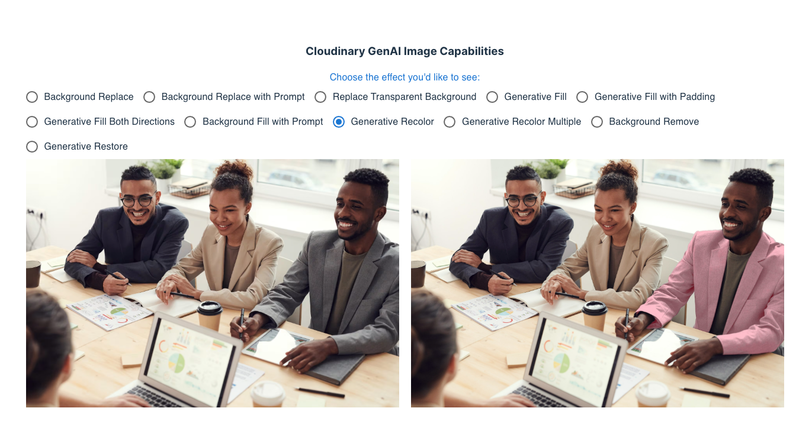

# Cloudinary Generative AI Demo Application

This app uses the React SDK to showcase Cloudinary's generative AI image transformation capabilities. 
It implements many of the examples from [the documentation](https://cloudinary.com/documentation/generative_ai_transformations).

It uses images in the `demo` account, so you can run this app locally with no additionally setup. 

To run locally:

1. `npm i`
2. `npm run dev`

Once the app is running, visit `http://localhost:3000`, and you should see a screen similar to the following:

